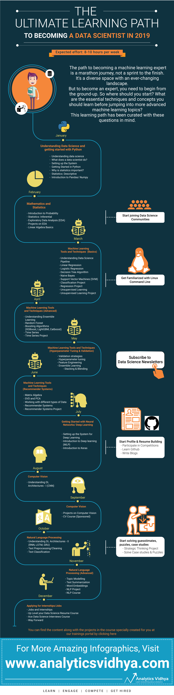

## Learning Path to become a Data Scientist in 2019

Broadly, the learning path to become a data scientist can be divided into the following steps:

1. **Getting Started**: The biggest step of them all – beginning your data science journey. This stage is all about understanding what data science is and what a data scientist role entails. Additionally, this is where you should pick up the programming language and tool of your choice (our recommendation is Python). This will enable you to code through all that you learn in the coming months

2. **Learning Basic Maths and Statistics**: What are the core concepts a data scientist must absolutely know? That would be statistics and mathematics. Where learning a tool will help you perform quick calculations and generate results, you can’t truly become a data scientist until you have a solid grasp on statistical methods (probability, descriptive and inferential stats) and mathematical fields (linear algebra to be precise). That’s why we emphasize on these two fields in this year’s learning path

3. **Learning Machine Learning concepts and applying them**: This is where things start to hear up – you’re reading this article because you’ve been intrigued by what machine learning can do. And once you’re done with the above points (by March start if you follow the learning path), you will start learning the basics of machine learning. But this isn’t just limited to theoretical concepts. We firmly believe in learning by doing, hence we have provided some awesome projects so you can experience what a data scientist does!

4. **Some more applications of Machine Learning**: Once you have a good grasp on these basic techniques, we move along in April to more advanced topics, like ensemble learning, random forest, boosting algorithms, and time series methods. But ML isn’t limited to just the algorithms, you need to know nifty tricks to improve your model, right? That’s where validation strategies and feature engineering will play a role. We also encourage you to keep your focus on industry applications, and have hence included a recommendation engine project in the learning path

5. **Introduction to Deep Learning**: Now you know these machine learning concepts, what comes next? Deep learning of course! It’s becoming an essential part of any data scientist’s CV these days. July should see your data scientist path lean towards understanding neural networks and getting the hang of Keras.

6. **Various deep learning architectures like RNN, CNN**: Follow that up with a deep dive into advanced neural network frameworks, namely recurrent neural networks and convolutional neural networks. These are fairly heavy concepts, hence we recommend spending a few weeks on understanding them from scratch
Computer Vision Applications: Computer vision is one of the hottest fields right now and hence we have focused a lot on this domain. We feel every data scientist should absolutely have this on their resume since this is where a lot of the jobs in the future will come up. We have included a really cool project to give you a practical understanding of how a computer vision model works.

7. **Natural Language Processing (NLP)**: No data scientist learning path is fully complete without first going over NLP. You should focus on learning the basics at the very least, including text preprocessing and text classification. If you’re feeling adventurous, you can explore how deep learning works in NLP but that’s not a mandatory requirement

We have broken down all these steps month on month – so if you start following the learning path, you know exactly what you need to follow and what you need to cover every month starting today.

Here is an image laying out what should you do month on month to become a data scientist by the end of 2019. **If you put in all the efforts as mentioned in the learning path – you will be well placed to get into a data scientist role before the end of the year.**

